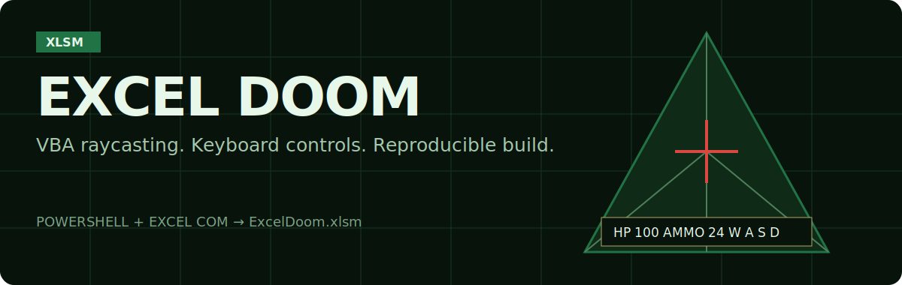

<p align="center">
  
</p>

Мини-версия DOOM-подобной игры на VBA: PowerShell собирает воспроизводимый
`.xlsm`, а Excel становится экраном, HUD и игровым циклом.

## Что уже работает

- псевдо-3D рендер через raycasting;
- управление с клавиатуры через `Application.OnKey`;
- враги-спрайты, стрельба, здоровье и патроны;
- миникарта и HUD на листе Excel;
- воспроизводимая сборка через PowerShell и Excel COM.

## Быстрый старт

```powershell
powershell -ExecutionPolicy Bypass -File .\scripts\build_excel_doom.ps1
```

Открой `output/spreadsheet/ExcelDoom.xlsm`, разреши макросы и при необходимости
запусти `ExcelDoom_StartGame` через `Alt + F8`.

## Проверка

```powershell
powershell -ExecutionPolicy Bypass -File .\scripts\smoke_test_excel_doom.ps1
```

## Управление

- `W` / `↑`: идти вперёд
- `S` / `↓`: идти назад
- `A`, `D` / `←`, `→`: поворот
- `Q`, `E`: шаг вбок
- `Space`: выстрел

## Ограничения

Это не полноценный порт оригинального DOOM, а компактная Excel-реализация в том же духе: псевдо-3D коридоры, враги и стрельба в рамках ограничений VBA и листа Excel.
